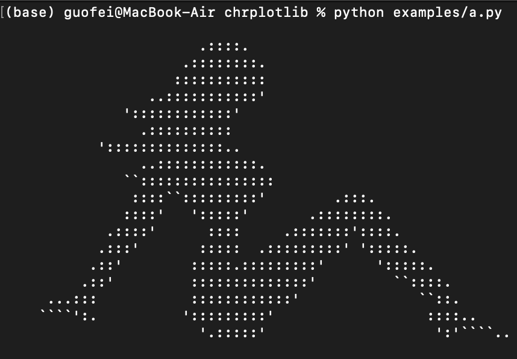
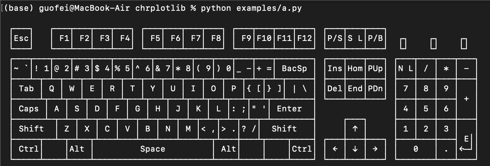
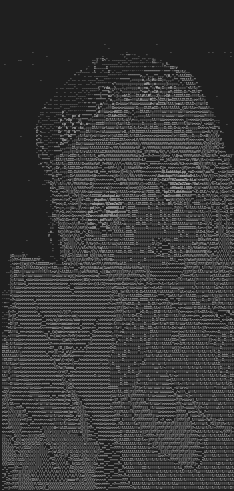
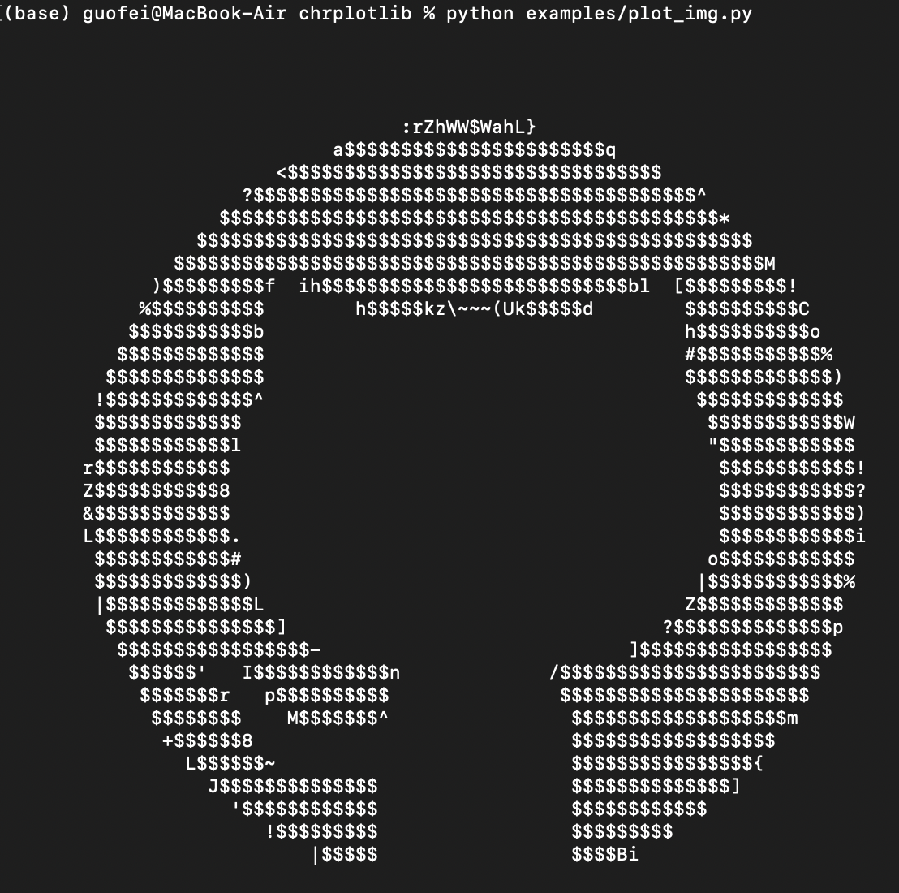
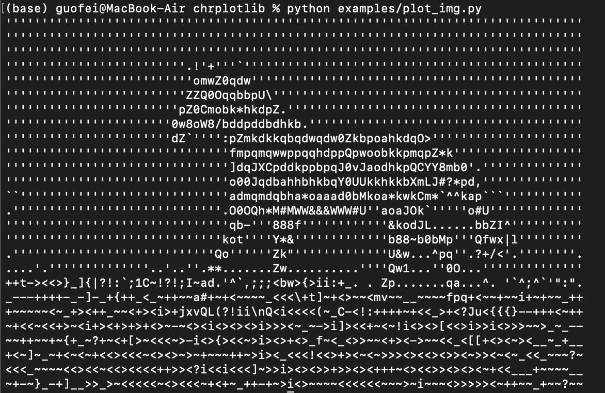
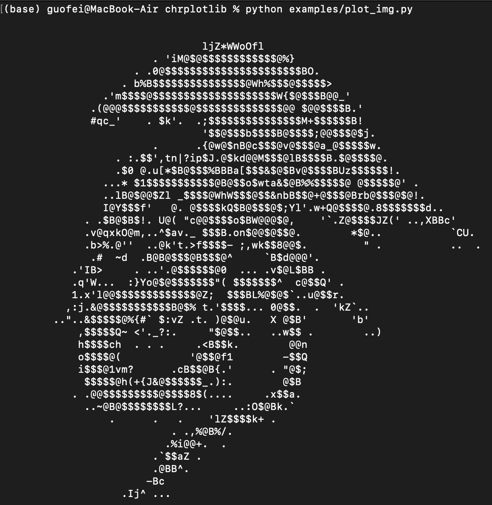

# chrplotlib
Plot graphs using chars

install:
```bash
$pip install chrplotlib --upgrade
```

For the current developer version:
```bash
git clone git@github.com:guofei9987/chrplotlib.git
cd chrplotlib
pip install .
```

## example

```python
from chrplotlib import animation


def update_bar(i):
    data = 10 * np.random.rand(20)
    print(bar(data, label=range(20), max_height=10))
    print('\033[{}A'.format(12))


animation(update_func=update_bar, interval=range(100), pause=0.2)
```


```python
data = 10 * np.random.rand(20)
label = range(20)
```

```python
print(bar(data))
```

Print this:
```
                                 ▃▃                         
▃▃                      ▃▃       ██                ▅▅       
██ ▇▇                   ██       ██       ▇▇       ██       
██ ██                   ██       ██       ██       ██       
██ ██             ▇▇ ▃▃ ██       ██       ██       ██       
██ ██ ▄▄ ▅▅       ██ ██ ██       ██       ██       ██    ▃▃ 
██ ██ ██ ██    ▂▂ ██ ██ ██       ██ ▃▃    ██       ██    ██ 
██ ██ ██ ██    ██ ██ ██ ██       ██ ██    ██       ██    ██ 
██ ██ ██ ██    ██ ██ ██ ██ ▄▄ ██ ██ ██    ██    ▂▂ ██ ▇▇ ██ 
██ ██ ██ ██ ▃▃ ██ ██ ██ ██ ██ ██ ██ ██ ▃▃ ██ ██ ██ ██ ██ ██ 
```

```python
print(bar(data=data, label=range(20)))
```

Print this:
```
                                 ▃▃                         
▃▃                      ▃▃       ██                ▅▅       
██ ▇▇                   ██       ██       ▇▇       ██       
██ ██                   ██       ██       ██       ██       
██ ██             ▇▇ ▃▃ ██       ██       ██       ██       
██ ██ ▄▄ ▅▅       ██ ██ ██       ██       ██       ██    ▃▃ 
██ ██ ██ ██    ▂▂ ██ ██ ██       ██ ▃▃    ██       ██    ██ 
██ ██ ██ ██    ██ ██ ██ ██       ██ ██    ██       ██    ██ 
██ ██ ██ ██    ██ ██ ██ ██ ▄▄ ██ ██ ██    ██    ▂▂ ██ ▇▇ ██ 
██ ██ ██ ██ ▃▃ ██ ██ ██ ██ ██ ██ ██ ██ ▃▃ ██ ██ ██ ██ ██ ██ 
0  1  2  3  4  5  6  7  8  9  10 11 12 13 14 15 16 17 18 19

```


```python
print(bar(data, kind='bar'))
```

Get this:
```
  █▌█▌█▌█▌█▌█▌█▌█▌▌   
  █▌█▌█▌█▌█▌█▌█▌█▌    
  █▌█▌█▌█▌▋           
  █▌█▌█▌█▌█           
  ▌                   
  █▌█▌█▌▎             
  █▌█▌█▌█▌█▌█▌        
  █▌█▌█▌█▌█▌▌         
  █▌█▌█▌█▌█▌█▌█▌█▌▍   
  █▌▋                 
  █▌█▌                
  █▌█▌█▌█▌█▌█▌█▌█▌█▌▌ 
  █▌█▌█▌▍             
  ▌                   
  █▌█▌█▌█▌█▌█▌█▌█▌    
  █▌                  
  █▌▎                 
  █▌█▌█▌█▌█▌█▌█▌█▌█▎  
  █▌█▌                
  █▌█▌█▌█▌▌           
```


```python
print(bar(data=data, label=range(20), kind='barh'))
```

Get this:
```
0 █▌█▌█▌█▌█▌█▌█▌█▌▌   
1 █▌█▌█▌█▌█▌█▌█▌█▌    
2 █▌█▌█▌█▌▋           
3 █▌█▌█▌█▌█           
4 ▌                   
5 █▌█▌█▌▎             
6 █▌█▌█▌█▌█▌█▌        
7 █▌█▌█▌█▌█▌▌         
8 █▌█▌█▌█▌█▌█▌█▌█▌▍   
9 █▌▋                 
10█▌█▌                
11█▌█▌█▌█▌█▌█▌█▌█▌█▌▌ 
12█▌█▌█▌▍             
13▌                   
14█▌█▌█▌█▌█▌█▌█▌█▌    
15█▌                  
16█▌▎                 
17█▌█▌█▌█▌█▌█▌█▌█▌█▎  
18█▌█▌                
19█▌█▌█▌█▌▌        
```

### plot images by name

```python
from chrplotlib import img

img_plotter = img.ImagePlotter()

for name in img_plotter.get_all_names():
    print(f"name:{name}")
    print(img_plotter.from_name(name=name))
```

Will print this:



   


### plot from image file

```python
from chrplotlib import img
import cv2
import os

CURRENT_DIR = os.path.dirname(os.path.abspath(__file__))
IMAGE_DIR = os.path.join(CURRENT_DIR, 'data')

img_path = os.path.join(IMAGE_DIR, 'img1.jpeg')

img_data = cv2.imread(img_path)

# print it 
print(img.plot_from_img(img_data, max_width=80))

# or save it to .txt file
with open("output.txt", "w") as f:
    f.write(img.plot_from_img(img_data, max_width=150))
```

from this image:


print this:




Plot more images:





